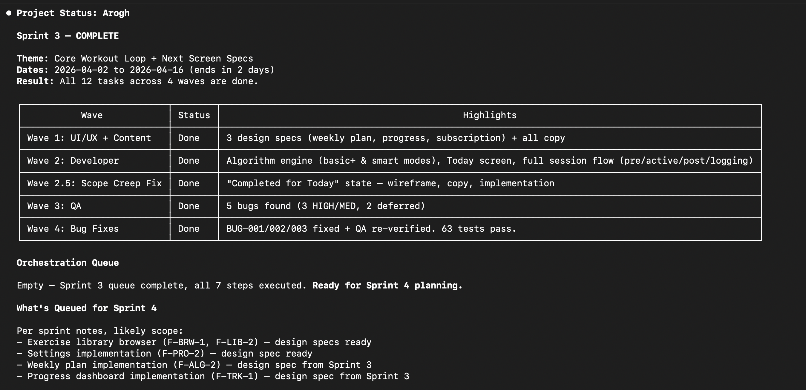

# Muster

**Ship a product. Without a team.**

*Eight AI specialists. Persistent memory. Just Claude Code.*



A real product needs design, code, QA, content, marketing, legal, and research.

You can't hire all of that. You don't have to.

Muster turns Claude Code into a coordinated team of eight AI specialists with persistent memory, quality guardrails, and conversational continuity. Every decision persists. Every sprint plans itself forward. Every specialist remembers the discussion across follow-ups — no re-briefing on every turn, no Claude amnesia between sessions.

Just markdown files. No external frameworks. No API wiring. No subscriptions.

```
You (Founder)
     |
     v
  Open Claude in project   →   Pick a role at session start
                                       |
                                       v
                              Session bound to ONE role:
                       PM | Dev | UI/UX | QA | Content | Mkt | Legal | Research
```

The PM coordinates: plans sprints, makes decisions, cascades context to specialists. Specialists do the domain work in their own session and file handoffs. Status line shows `[muster: <role>]` so you always know which tab is which.

Built and validated on a real iOS app, mid-construction. Not framework theory.

Just open Claude Code. Pick a role. Ship.

## The problem

Most multi-agent frameworks optimize for agent **communication** — how agents pass messages to each other. The real bottleneck is **context**. Claude Code agents forget everything between sessions. If you're building a product across design, dev, legal, marketing, and QA, you need persistent memory and a way to keep each agent focused on what matters.

## How Muster solves it

### Three-tier reading model

Each agent reads roughly 80 lines at startup — its role, filtered product context, and the current task. Full docs are loaded on demand. Files meant for other agents are never loaded at all.

### PM as context translator

When a decision is made, the PM doesn't tell every agent to go read the decision log. The PM updates each agent's context file with only what *that* agent needs. Decisions cascade through filtered summaries, not shared inboxes.

### Files as persistent memory

Agent brains, orchestration queues, handoff logs, and decision records persist as markdown. No session starts from zero — every agent picks up where the last one left off.

### Self-improving skills

During sprint planning, the PM scans for methodology gaps. New skills are classified as generic or product-specific. Generic skills are contributed back to the framework, so every project makes Muster sharper for the next one.

## Quick start

### New project

```bash
curl -fsSL https://raw.githubusercontent.com/sandhuka/muster-ai/main/scripts/setup-project.sh | bash -s my-project
cd ~/Desktop/my-project
claude
```

When Claude starts in a fresh project, the greenfield welcome fires automatically (no picker — onboarding is PM-driven). Tell Claude your product idea. The welcome walks you through five Discovery stages — idea share, market research, go/no-go decision, draft review, Sprint 1 plan. Total founder time is **~1–2 hours across ~3 sessions** over a day or two.

See [getting-started.md](getting-started.md) for the full walkthrough.

### Existing project

If you already have code — a mobile app you've been building for months, a web app with real users, a backend service, a CLI tool — Muster has a dedicated adoption path. It reverse-discovers your product into a populated knowledge base and plans Sprint 1. Takes about two hours of focused time.

```bash
cd ~/path/to/your-existing-project
curl -fsSL https://raw.githubusercontent.com/sandhuka/muster-ai/main/scripts/setup-existing-project.sh | bash
```

See [adopting-existing-project.md](adopting-existing-project.md) for the full walkthrough.

## How it works

You describe your idea in the first session — PM is auto-bound for the greenfield welcome. PM sends Research to investigate the market, then writes the product spec, plans a sprint, and queues up agent tasks if the idea is viable.

After Discovery, you follow the orchestration queue. For each step, open a Claude session — pick the listed role from the picker (or set `MUSTER_ROLE=<role>` to skip the picker for scripts/automation). Sessions can run in parallel across separate terminals when tasks are independent. Each session reads its filtered context, does the work, files a handoff, and promotes the next step. Repeat until shipped.

The status line shows `[muster: <role>]` so you always know which role this session is bound to. `/rebind` swaps roles mid-session if you picked wrong.

## Agent roster

| Agent | Role |
|-------|------|
| **PM** | Plans sprints, cascades context, reviews deliverables, makes decisions |
| **Research** | Market analysis, competitive teardowns, user insights, product validation |
| **Developer** | Production code, architecture, testing — iOS, backend, web, and generic skills |
| **UI/UX** | Wireframes, user flows, component specs, design tokens |
| **QA** | Test strategy, bug tracking, release validation |
| **Content** | In-app copy, blog, email, store listings, help docs |
| **Marketing** | Growth strategy, campaigns, user acquisition, analytics |
| **Legal** | Compliance, privacy, terms of service, IP protection (guidance, not legal advice) |

All eight are peer roles bound the same way (picker or `MUSTER_ROLE` env var). PM is special only in what it owns (knowledge-base writes), not in how sessions bind to it.

## How is this different?

| | CrewAI / AutoGen / LangGraph | Muster |
|---|---|---|
| **Solves** | Agent communication | Agent memory and context efficiency |
| **Built on** | Python libraries, API layers | Markdown files and Claude Code |
| **Requires** | Code to define agents | No code — file-based configuration |
| **Built from** | Framework design theory | A real iOS app, mid-build |
| **Includes** | Agent orchestration primitives | Operational patterns — growth caps, cascade lag prevention, decision autonomy, pre-handoff self-review |
| **Improves** | Manual updates by maintainers | Projects discover skill gaps and contribute generic skills back to the framework |

## Architecture

Muster uses a two-repo model.

```
my-project/
├── .claude/
│   ├── agents/            # Bootloaders for all 8 roles (invoke via picker or @<role>)
│   ├── skills/rebind/     # /rebind slash command (mid-session role swap)
│   ├── statusline.sh      # Status-line script (shows [muster: <role>])
│   └── settings.json      # Wires statusline + Claude Code config
├── CLAUDE.md              # Product info + project-specific rules + bootstrap routing
├── muster/                # <-- Git submodule (this repo)
├── knowledge-base/
│   ├── agent-context/     # Per-agent filtered product context (PM writes, agents read)
│   ├── product-spec.md
│   ├── orchestration-queue.md
│   ├── agent-requests.md
│   └── .muster-bind-log   # Audit trail of role binds per session
└── src/                   # Your code
```

**Muster** (this repo) contains agent roles, skills, and protocols — shared across all projects via git submodule. **Your project** contains product context, knowledge base, and source code. One framework, many projects.

## Documentation

| Doc | What it covers | Read when |
|-----|---------------|-----------|
| [getting-started.md](getting-started.md) | Step-by-step setup and first sprint | Setting up a new (greenfield) project |
| [adopting-existing-project.md](adopting-existing-project.md) | Reverse-discovery onboarding for projects with existing code | Adopting Muster into an existing codebase |
| [architecture-and-design.md](architecture-and-design.md) | Architecture deep dive — data flow, context management, agent communication | Evaluating whether to adopt Muster |
| [system-guide.md](system-guide.md) | Templates, extensibility, verification checklist | Adding agents, skills, or modifying the framework |
| [MIGRATING-V2-TO-V3.md](MIGRATING-V2-TO-V3.md) | Upgrade an existing v2 project to v3 (role-picker, status line, /rebind) | Adopting v3 from an existing v2 project |
| [MIGRATING-V1-TO-V2.md](MIGRATING-V1-TO-V2.md) | One-shot migration for projects set up before v2 | A `muster/` update halted with "Pre-v2 Muster setup detected" |

## Stay updated

Star or watch this repo for release notifications on GitHub. For major version notes — new agents, new skills, framework improvements — [subscribe to email updates](https://buttondown.com/muster-ai). Release notes only.

## License

MIT License. See [LICENSE](LICENSE).
